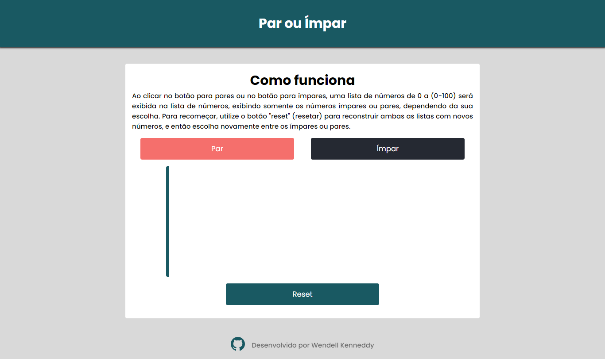

# Par ou Ímpar

---

## :bookmark_tabs: Tabela de Conteúdo

- [:closed_book: Sobre](#closed_book-sobre)
- [:hammer_and_pick: Tecnologias utilizadas](#hammer_and_pick-tecnologias-utilizadas)
- [:sparkles: Features](#sparkles-features)
- [:pushpin: A ser adicionado](#pushpin-a-ser-adicionado)
- [:handshake: Seja um contribuidor](#handshake-seja-um-contribuidor)

---

## :closed_book: Sobre

Par ou Ímpar é uma aplicação simples, que retorna uma lista não ordenada de números de 0 a (0-100), filtrando os pares ou ímpares, de acordo com a escolha do usuário.

Escolha entre os botões "par" ou "ímpar", e a lista será exibida, mostrando somente os pares ou ímpares. Para reconstruir a lista, utilize o botão "reset", e escolha novamente entre os dois primeiros botões.

---

## :hammer_and_pick: Tecnologias utilizadas

- Visual Studio Code (Editor de código)
- HTML5
- JavaScript
- SCSS (convertido para CSS)

---

## :sparkles: Features

- Criação de uma lista baseada em um único número aleatório
- Reconstrução da lista a partir de um botão
- Responsividade

---

## :pushpin: A ser adicionado

- [ ] Dark Mode (Tema escuro)
- [ ] Input de um número para ser utilizado como base para construção da lista

---

## :handshake: Seja um contribuidor

Teve uma ideia ou notou algo que poderia melhorar ainda mais o projeto, e deseja implementar? É simples!

1. Faça fork do projeto
2. Aplique suas mudanças e commite-as
3. Crie um Pull Request com suas implementações
